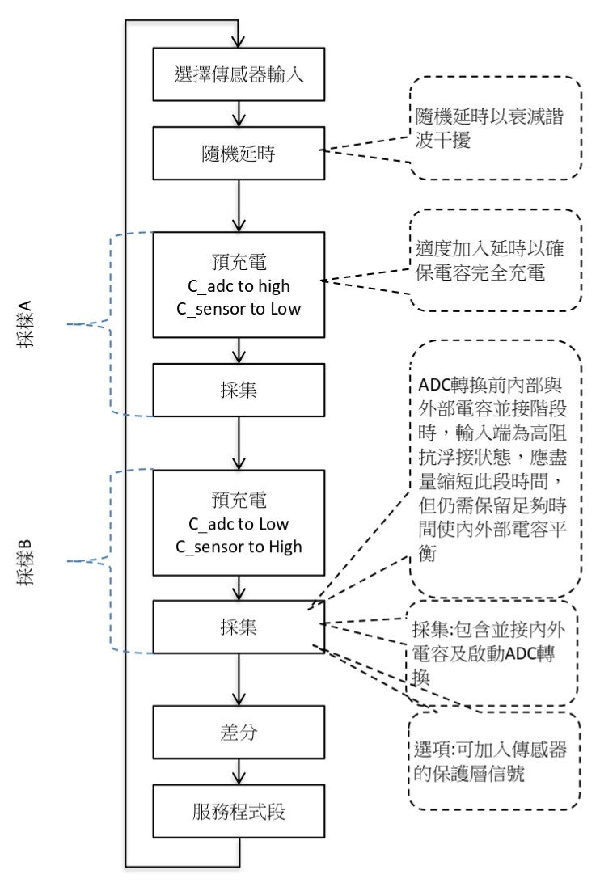

# PIC based capacitive divider touch sensor circuit
This is a touch sensing circuit based on the principle of capacitive voltage division. It employs differential measurement techniques, which effectively reduce interference from environmental noise, thereby enhancing detection accuracy. When a finger touches or approaches the sensing area, the capacitance of the sensor changes, causing a variation in the voltage division ratio. The PIC microcontroller, using its built-in ADC, detects and processes these changes to accurately identify touch actions.  
這是一個依據電容分壓原理的觸控感應電路，採用了差分測量技術，可以有效減少環境噪聲對觸控偵測的干擾，提升感應準確度。
當手指接觸或靠近感應區域時，感應器的電容值會改變，導致電壓分壓比的變動。PIC 微處理器以內建的 ADC 檢測並處理這些變化，進而精確識別觸控動作。

## CVD 的優點
1. 低溫度依賴性：在 -20°C 至 +60°C 範圍內，信號偏移通常只有 1-3%。通常根據傳感器值的緩慢變化在軟體補償此偏移量。
2. 低 $`V_{DD}`$ 依賴性：因為感應器的電荷與 ADC 的參考電壓相同，因此 $`V_{DD}`$ 的低頻變化對信號影響不大，但高頻干擾可能會產生噪聲。
3. 硬體需求低：只需簡單的硬體配置，如串聯電阻即可降低噪聲，如果噪聲不重要，甚至不需要外部元件。
4. 低頻噪聲抑制：CVD 波形的兩次 ADC 取樣會因為差分方法而互相抵消低頻噪聲，同時放大有效信號。

## 工作原理
請參考 Microchip AN1478 mTouch™ Sensing Solution Acquisition Methods Capacitive Voltage Divider

## hex File
[CVD ver B](code-verB/hex/CVD_ver_B.production.hex)
## Schematic 電路圖

## 參考資料
- Microchip AN1478 mTouch™ Sensing Solution Acquisition Methods Capacitive Voltage Divider

## Prototype 樣機展示

*ver A*  

*ver B*  

***
本文件中引用的部分資料來自 Microchip Technology Inc. 的應用參考文件 AN1478 "mTouch Sensing Solution Acquisition Methods Capacitive Voltage Divider"。這些內容的版權歸 Microchip Technology Inc. 所有。根據該公司的版權規定，本資料僅供參考使用，非商業用途。若需進一步使用或商業應用，請參考 Microchip Technology Inc. 官方網站上的版權聲明或聯繫該公司以獲取授權。  
Some of the content in this document is sourced from Microchip Technology Inc.'s application note AN1478 "mTouch Sensing Solution Acquisition Methods Capacitive Voltage Divider". All rights to these materials are reserved by Microchip Technology Inc. This material is provided for reference only and non-commercial use. For further use or commercial applications, please refer to the copyright notice on Microchip Technology Inc.'s official website or contact the company for permissions.
***
